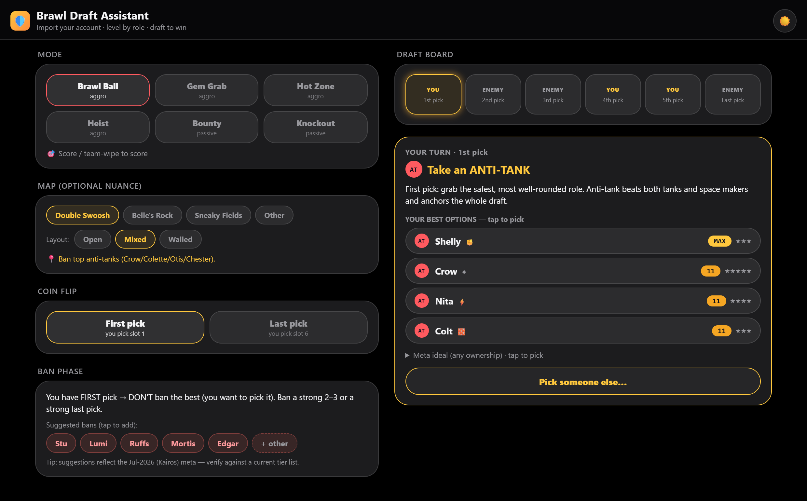
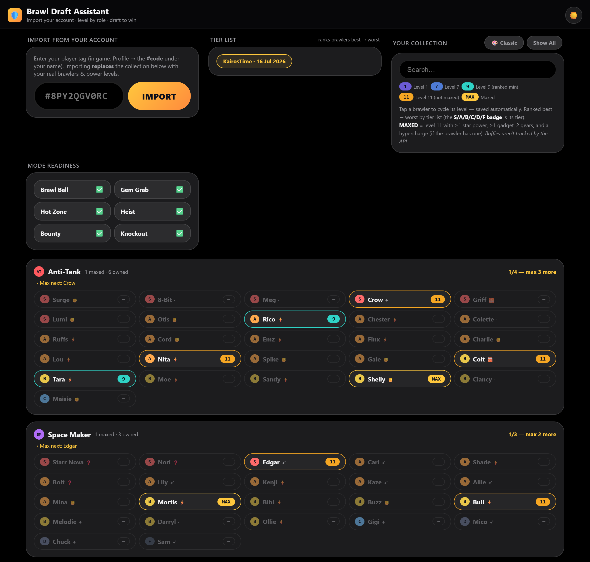

## What is Brawl Stars?

*Brawl Stars* is Supercell's mobile arena game: 3v3 matches about two minutes long, played with characters called brawlers. There are over 100 brawlers, each unlocked and upgraded separately, and for a free-to-play player the upgrade resources come slowly. Ranked mode is where that bites: entry to each rank is gated by how many upgraded brawlers you own, and at higher ranks both teams draft picks and bans before the match, so a thin roster is a real handicap.

This project is a small React app that helped me climb to Mythic, a top-1% rank, while maxing almost nothing.

## The problem: a resource-allocation trap

Brawl Stars ranked mode is gated by investment. The ladder runs Bronze, Silver, Gold, Diamond, Mythic, Legendary, Masters, Pro, and the entry requirements climb with it:

- Bronze through Gold: three brawlers at Power 9
- Diamond: nine brawlers at Power 9
- Mythic: twelve brawlers at Power 11

From Diamond up, matches become best-of-three with a pick-and-ban draft, so what you have levelled directly limits what you can play.

Fully maxing one brawler (Level 11, gears, gadgets, star powers) is expensive, and a free-to-play player can only afford a handful. Meanwhile the "best brawlers" lists churn with every balance patch. I had already paid the tuition for getting this wrong: some of my Power 11s from 2024 were tier-list impulse buys I never used again.

Fewer than 1% of players hold Mythic at any time. I wanted to get there without maxing half the roster. So which brawlers deserve the resources?

## The insight: invest in roles, not names

The strategy layer comes from Bobby, a veteran coach whose draft guide reframes the game: every brawler belongs to one of 7 draft roles (Anti-Tank, Space Maker, Tank, Control, Sniper, Thrower, Support), and games are won by how roles counter each other, not by who is "S tier" this month.

That reframing matters because of what changes and what does not. Individual brawler strength shifts every patch. The role structure and its counter web are stable. Any plan built on names goes stale in weeks; a plan built on roles survives.

So the investment rule becomes: cover the high-value roles with one solid pick each, and only then deepen. A maxed Anti-Tank plus a maxed Space Maker is close to a guaranteed strong draft in most modes. A fourth S-tier Sniper is a wasted slot.

## What I built

I distilled Bobby's two guide videos into reference docs, then built a single-file React app with two tabs:

- **Draft**: a live coach for ranked. Pick the mode, map and layout, record picks in the real 1-2-2-1 snake order, and on each of my turns it names the role to take, why, and my best owned options. It recomputes as enemy picks land (enemy took a Space Maker and has no Anti-Tank, so take a Tank).
- **Brawlers**: the collection tracker and the payoff in one. Every brawler is grouped by role and tapped to set its level. That feeds a per-mode readiness check and a "max next" recommendation per role, computed from role coverage rather than tier lists, so the only question that spends resources, who to max next, is always on screen.

## Decisions that shaped it

- **Reason at the role level, not brawler-vs-brawler.** A full counter matrix for 100+ brawlers would be endless to maintain and false-precise. Seven roles and a small counter web cover most of the decision quality at a fraction of the upkeep.
- **Keep the meta as a thin, swappable layer.** Tier scores live in one small constant, separate from the role structure. A balance patch means editing a few numbers, not rethinking the model.
- **Cut scope where the value is thin.** 3v3 ranked only, a curated map list instead of a live map database. Both were deliberate trades of coverage for shippability.

## The result

Climbing this season, I met the twelve Power 11 gate mostly with bare minimums and rotated just 3 to 4 fully maxed brawlers chosen by role coverage. Casual play across the season took me to a peak of Mythic II, a rank held by fewer than 1% of players.

My ranked profile: peak Mythic II (5,475 highest)

The contrast with my 2024 roster, built by chasing tier lists, is the whole point. Same game, same wallet, different allocation logic.

The app is decision support, but the durable artifact is the framework: when resources are scarce and the environment keeps shifting, optimise on the structure that persists, and treat everything volatile as a thin layer you can re-tune cheaply.

*Strategy credit: Bobby (twitch.tv/bobbybs). This is an unofficial fan project, not affiliated with Supercell or Bobby.*
