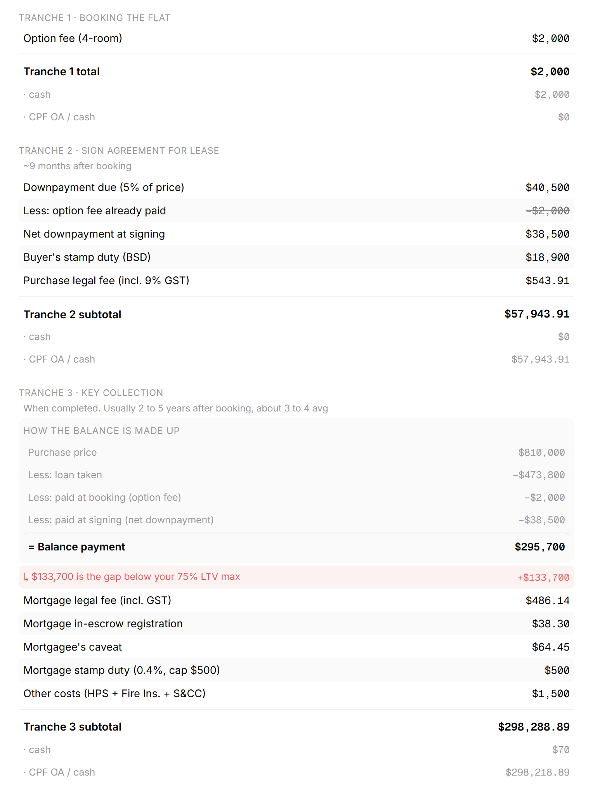
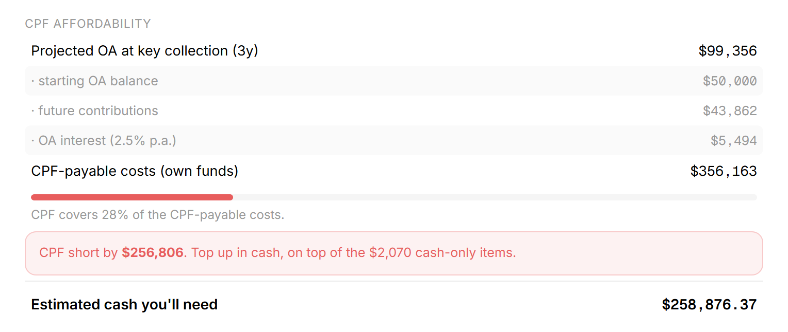
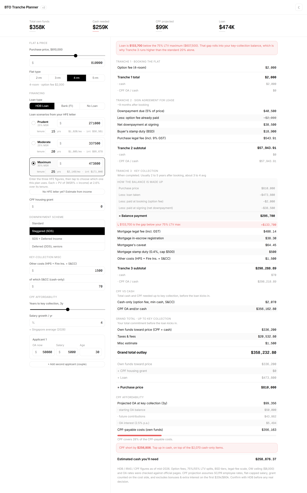

## What is a BTO?

Three terms carry this whole writeup:

- **BTO (Build-To-Order)** is Singapore's system for buying new public housing. You apply (ballot) for a project before it is built; if your queue number comes up, you pick a specific unit, then wait years for the keys.
- **HDB** is the public housing authority. It builds and sells the flats, and also offers a housing loan as an alternative to a bank loan.
- **CPF** is the national savings scheme. A slice of every salary goes into it, and the Ordinary Account can pay for housing, within rules. For most buyers the binding constraint is not the total price but how much must be paid in cash versus how much CPF can cover.

If you already know all this, skip ahead. The interesting part is *when* the decisions happen.

## The problem happens before the first payment

A Singapore BTO purchase pays out in three tranches:

- **Booking**, right after you select a unit
- **Signing the Agreement for Lease**, about 9 months later
- **Key collection**, 2 to 5 years after that

What each tranche costs, and how much of it can come from CPF instead of cash, depends on flat type, financing (HDB vs bank loan), the loan-to-value limit, the downpayment scheme and the grants you qualify for. The rules are all public, but scattered across HDB, IRAS and CPF pages.

Here is the thing: by the time HDB tells you your numbers, you have already made the decisions that matter.

- **Balloting.** Before you even apply, you know each project's rough price band. The highest floors sit near the top of the band, the lowest near the bottom. Whether a Prime, Plus or Standard project is affordable *for you* is decided at ballot time, with no official per-price breakdown in hand.
- **Unit selection.** Once your queue number is called, available units refresh daily and you shortlist floors and prices while waiting for your appointment. At the appointment you commit, quickly, from whatever is left.

Both moments need the same answer, instantly, for any price you point at: what does this unit cost us at each milestone, how much is locked to cash, and does our CPF cover the rest?

## Decision 1: verify before building

I started from a build spec and checked every figure against the official source before writing code. That paid off immediately. The spec had two material errors:

- **Option fees were 4x too high** ($2,000 to $8,000 instead of the correct $500 to $2,000 by flat type).
- **The bank-loan path used 55% LTV downpayment splits as the default**, when 75% LTV is the normal case. The calculator got a proper 75/55 toggle with the correct cash-minimum rules for each.

Every calculation in the final app carries a reference to the HDB, IRAS, CPF or MAS page that confirms it, so any number can be independently re-verified when rates change. Later rounds of verification caught subtler issues too: the mortgage legal fee uses a scale 1.5x the purchase conveyancing scale, not the same scale, and the HDB loan must be capped at 75% of price no matter what the HFE letter approves.

## Decision 2: model the question people actually ask

The arithmetic (stamp duty tiers, legal fee scales, downpayment splits) is table stakes. The design choices were about the decision:

- **Live recalculation, no submit button.** During unit selection you are scanning many prices quickly. The whole receipt updates as the price slider moves.
- **Cash vs CPF split per tranche.** The binding constraint for most buyers is not the total, it is the cash-only floor (option fee, bank-loan minimum cash, first S&CC). The app shows the minimum cash and the CPF ceiling separately, per tranche.
- **A CPF affordability projection.** It projects both applicants' CPF OA balances forward to key collection (salary, age-based allocation rates, the $8,000 wage ceiling, 2.5% interest, salary growth) and answers the real question: will our CPF cover the CPF-payable part, and if not, how much cash do we need to find?
- **HFE loan scenarios that match reality.** From real HFE letter screenshots I confirmed HDB's actual formula (present value of the MSR-capped instalment at 2.6% over the tenure) and reproduced the letter's three scenarios, so the calculator's loan figures reconcile with the letter buyers actually hold.

## The result

Point the calculator at any price in a project's band and the full picture appears in seconds: three tranches, each split into cash and CPF, the loan gap if you borrow below the cap, and whether projected CPF covers it. At ballot time that turns "can we afford Prime?" into a comparison you can rank. At selection time it turns a daily-refreshing unit list into a shortlist with a known commitment attached to every floor.

The part I would defend hardest is not a feature. It is the habit of treating the spec as a claim to verify rather than a requirement to implement. Two of the biggest numbers in it were wrong, and the only reason the calculator can be trusted at a $500,000 decision is that every figure in it argues from a source.
